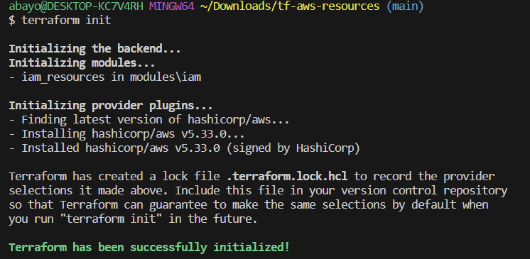
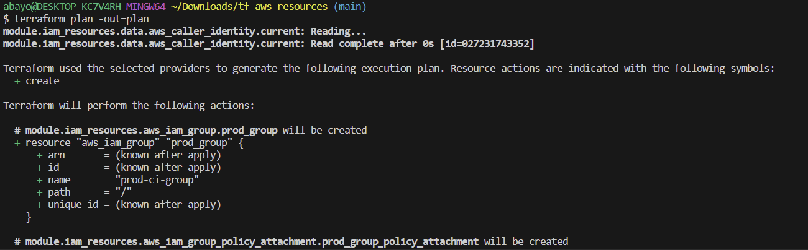
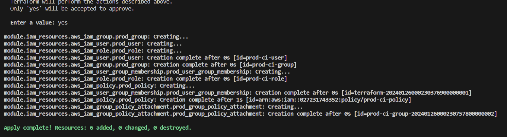
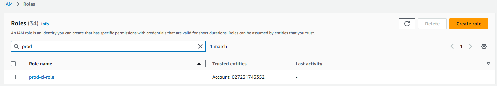
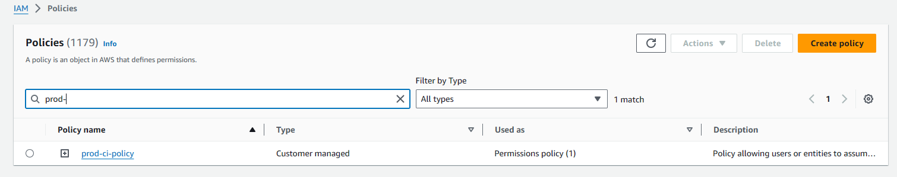
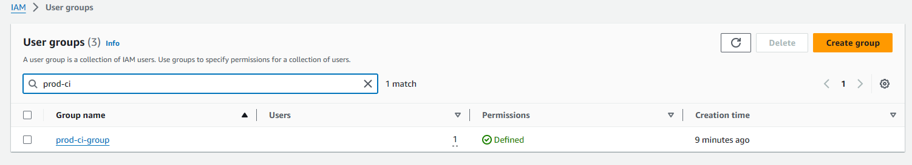
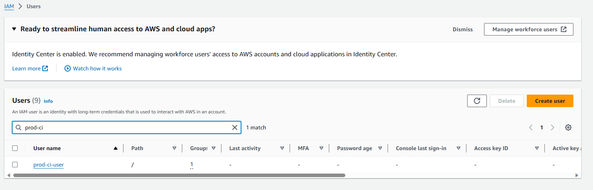

# Terraform AWS IAM Module

This Terraform module is designed to create a set of AWS IAM resources including a role, policy, group, and user. These resources are named with a common suffix for easy identification and management.

## Module Components

1. **IAM Role (`prod_role`)**: 
   - A role with no permissions that can be assumed by users within the same AWS account.

2. **IAM Policy (`prod_policy`)**: 
   - A policy allowing entities to assume the role.

3. **IAM Group (`prod_group`)**: 
   - A group with the above policy attached.

4. **IAM User (`prod_user`)**: 
   - A user belonging to the above group.

5. **Group Policy Attachment (`prod_group_policy_attachment`)**:
   - Attaches the policy to the group.

6. **User Group Membership (`prod_user_group_membership`)**:
   - Adds the user to the group.

## Usage

## Initialize and Apply Terraform configuration

After writing your Terraform configuration, the next step is to initialize the Terraform working directory and apply the configuration to create the infrastructure.

Here's an example output of a successful `terraform init` command:

Here's an example output of a successful `terraform plan` command:

Here's an example output of a successful `terraform apply` command:

## AWS Resources Created

### IAM Role
Here is the IAM Role created by the Terraform configuration:

### IAM Policy
Here is the IAM Policy attached to the role:

### IAM Group
Here is the IAM Group with the policy attached:

### IAM User
Here is the IAM User that belongs to the group:

## References
- [AWS IAM User Documentation](https://docs.aws.amazon.com/)
- [Terraform AWS IAM Policy Module](https://github.com/terraform-aws-modules/terraform-aws-iam)
- [Terraform AWS Provider Documentation](https://registry.terraform.io/providers/hashicorp/aws/latest/docs/resources/iam_role_policy_attachment)
